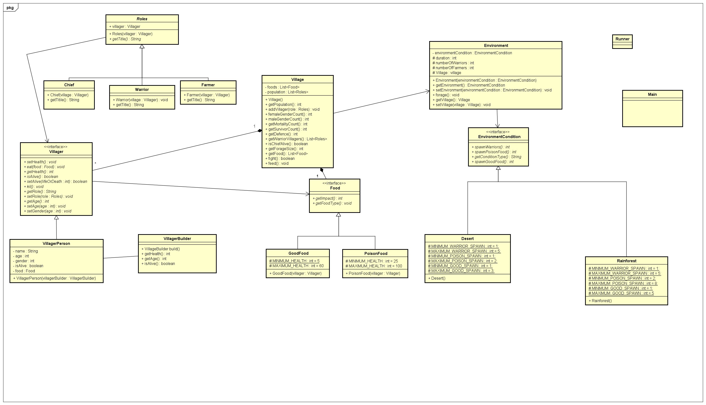

# VillageSimulator.
Design Patterns End Assignment

Authors: Virag Szabo, Johnathan Mohammed and Isaac Semackor.

## **Description of the village simulator system**.

The village simulator is a console line Java program which is controlled by the user from the terminal. It consists of villagers living in village. The user can create villagers. And, the villagers can have certain roles (chief, warrior, farmers), the villagers can gather food and this is influenced with the environment conditions you can spawn(desert or rainforest) if desert, you run out of food faster and, if rainforest you need warriors if not the rate at which villagers die increases.

**The Design Patterns used:**

Builder pattern: for creating villager with different properties.

Decorator pattern: for giving roles to the villagers. 

State pattern: for knowing the food state, if its good or poison food.

Strategy pattern: is use for spawning the different type of environment conditions (desert or rainforest).

## **Implementation**

The application will be coded in Java environment. The IDE that will be used for coding is IntelliJ by Jet Brains and GitHub will be used for collaborative coding, with the use of Git for version control.

## **Class Diagram.**

